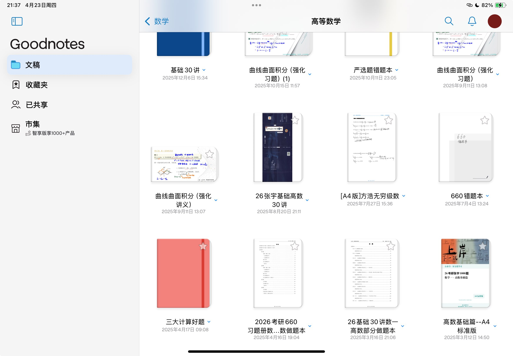
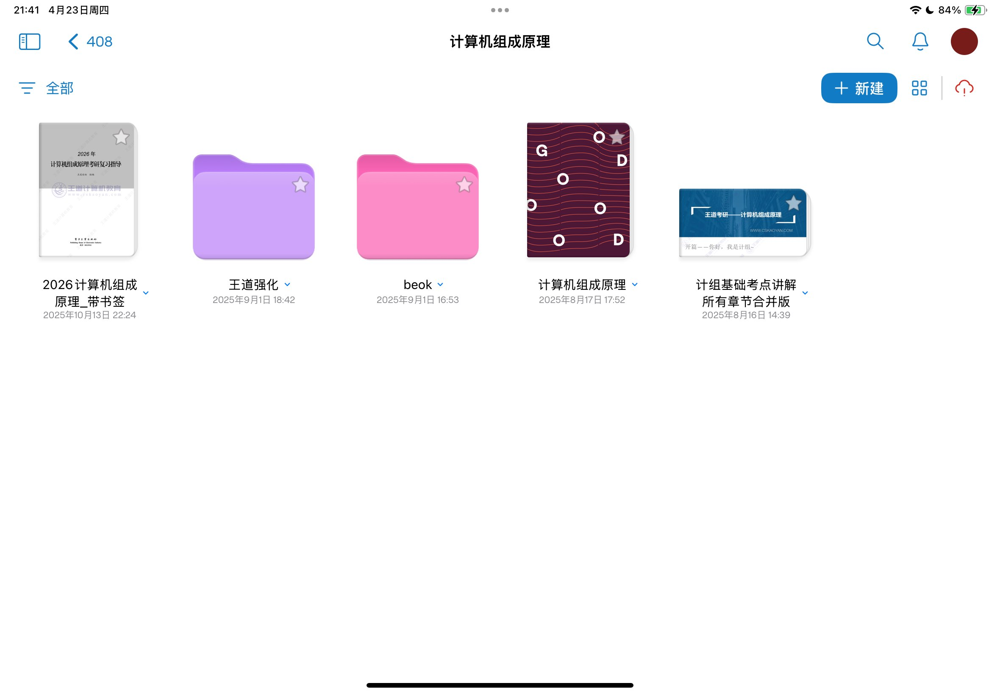
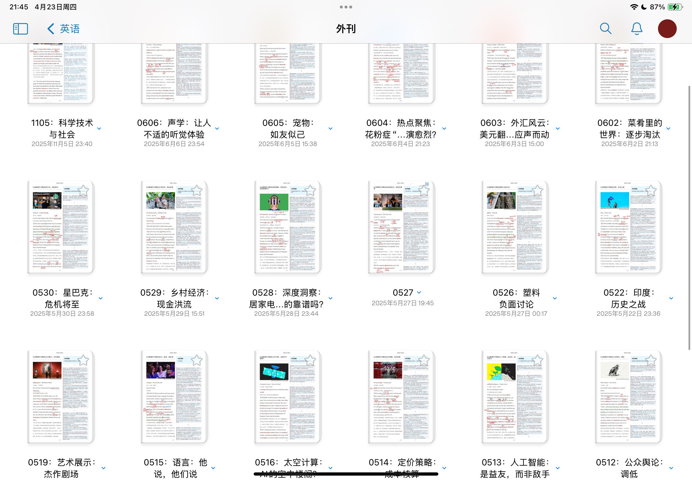
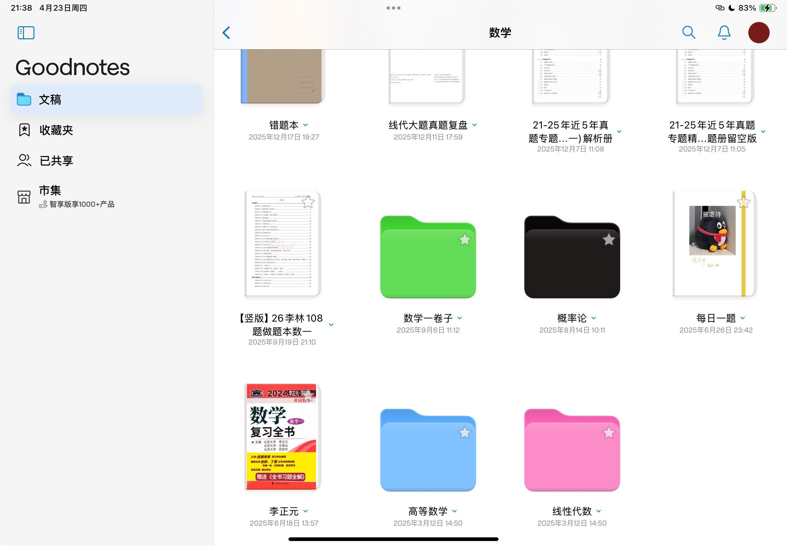

# Notes Archive

这是一个个人学习资料存档仓库。

## 仓库用途

- 用于保存我在备考研究生期间整理和积累的笔记资料，避免资料丢失。
- 以公开仓库的方式长期存档，同时秉持开源分享精神。
- 希望这些资料能为正在备考研究生的同学提供参考和帮助。

## 说明

- 本仓库内容以归档为主，不保证持续更新。
- 资料仅供学习交流使用，请结合自己的复习计划和教材进行取舍。
- 如涉及版权或内容问题，请通过 Issue 联系我处理。

## 致备考同学

考研路上不容易，愿你稳扎稳打，终有所成。祝大家都能去到理想的学校。

## 图片展示

